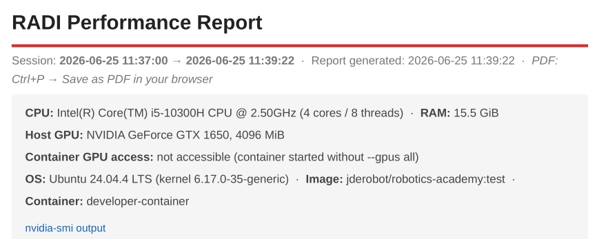
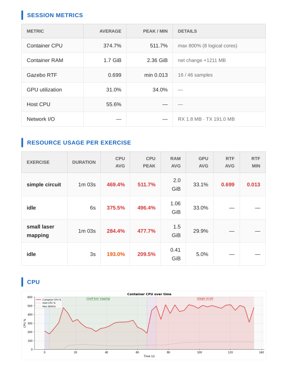
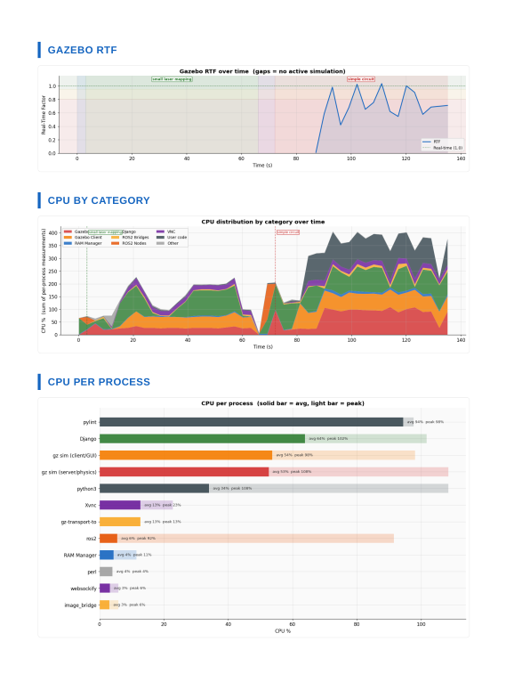

### [Back to main README.](../README.md)

# RADI Performance Monitor

`radi_monitor` is a small tool that watches a running RADI container while you use Robotics Academy and turns the session into a readable performance report. It lives in `scripts/radi_monitor/` and runs on the host next to Docker, without changing the image.

Reach for it when you want to know where the time and the memory go during an exercise. It answers questions like how much CPU Gazebo takes, whether the simulation keeps up with real time, how much RAM the container holds, and which processes are the heavy ones.



## What it measures

Every few seconds the monitor takes a sample. Five collectors run in parallel so the sampling stays cheap, and each sample records the following.

- Container CPU and RAM, network traffic and process count, read from `docker stats`.
- Per process CPU and RAM, measured with psutil running inside the container.
- The Gazebo Real Time Factor, read from the `/stats` topic. A value near 1.0 means the simulation runs at real speed.
- GPU utilization, memory and temperature when an NVIDIA or Intel/AMD GPU is available.
- Host CPU and RAM, so you can compare the container against the whole machine.

The active exercise is detected on its own from the world file name in the Gazebo command line, so the report groups the metrics by exercise with no extra effort. You can also label periods by hand. Type a name and press Enter while it runs to tag the current period, and press Enter on an empty line to clear the tag.

## Running it

The monitor needs `psutil` and `matplotlib` on the host, plus `weasyprint` if you want the PDF.

```bash
pip3 install psutil matplotlib weasyprint --break-system-packages
```

Start a RADI container, open an exercise, and in another terminal run the monitor.

```bash
cd scripts/radi_monitor
python3 monitor.py
```

It finds the container on its own by looking for the `robotics-backend` or `robotics-academy` image. Leave it sampling for as long as you want and press Ctrl+C to finish. On exit it writes the report and prints a short summary in the terminal.

A few options cover the common cases.

```bash
python3 monitor.py --interval 5             # seconds between samples, default 3
python3 monitor.py --output /tmp/my_session # base path for the output files
python3 monitor.py --container <name|id>    # pick a container instead of autodetecting
python3 monitor.py --verbose                # show internal progress
```

## The report

Each session produces three files side by side, by default under `/tmp/radi_<timestamp>`.

- `.html` is the report itself. Every chart is embedded, so the file is self contained and you can open or share it alone. Open it with `xdg-open radi_<timestamp>.html`.
- `.pdf` is the same report exported with weasyprint when it is installed.
- `.json` is the raw sample data, handy if you want to process it yourself.

The report opens with the headline numbers for CPU, RAM, RTF, GPU and duration, followed by a per exercise table that shows what each exercise cost.



Below that come the charts over time for CPU, RTF, memory, GPU and network, a breakdown of CPU by process category, and a process inventory with the heaviest processes. Idle stretches and exercise changes are marked on the charts so the timeline is easy to follow.



## How the code is organized

`monitor.py` is the entry point and holds the sampling loop. Everything else lives in `lib/`.

- `collector.py` gathers the data from Docker, the container, the GPU and the host.
- `analysis.py` turns the samples into the session and per exercise statistics.
- `charts.py` draws the charts with matplotlib.
- `report.py` builds the HTML and exports the PDF.

## Troubleshooting

If the per process table, the CPU by category chart or the automatic exercise detection come out empty, the container most likely has no usable `python3` with `psutil`, which is what the monitor runs inside it to read process data. The tool warns about this when it starts. The rest of the metrics still work, and you can label exercises by hand with the tagging described above.

If the RTF column stays empty, no simulation is publishing the `/stats` topic at that moment, which is expected while no exercise is loaded.
