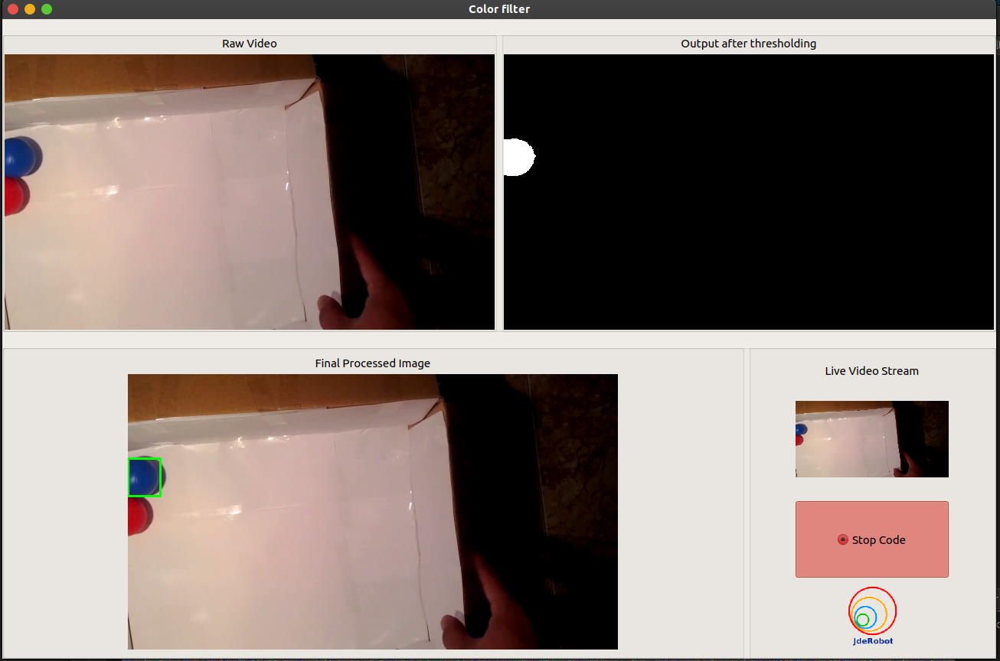
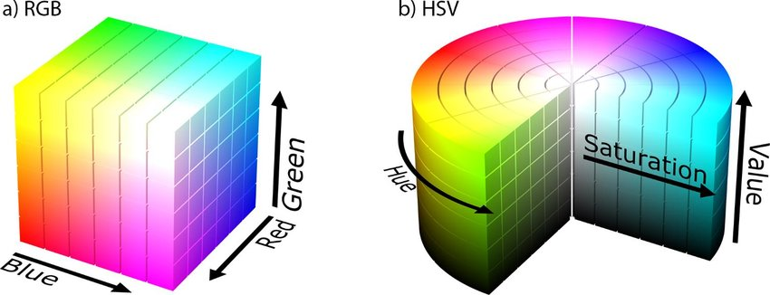

# Color Filter Exercise
		
In this practice the intention is to develop a color filter that allow us to segment some object in the image. You will have to get in contact with RGB and HSV color spaces, and *OpenCV* (*Python*) library.*Theory for the same is provided below*

For the exercise, we will need a node to publish the video stream. The *video_stream_opencv* package contains this node.
Add this packages if you don’t have it already:

`$ sudo apt install ros-melodic-video-stream-opencv`

<!--
For the realization of the practice, you are provided of a framework written in python that collects the images and allows its visualization. These images will be collected through several specific videos for this practice (pelota_roja.avi and pelotas_roja_azul.avi), although you could use your own videos instead or even a camera.

If you want to find the optimum values for your filter (in order to segment a concrete object) you can launch in a terminal the colorTuner component as follows (remember to run cameraserver tool as shown in line 39):

`$ colorTuner color_tuner_conf.yml`
-->

This practice allows to obtain the video stream from 3 different sources:
- From a local camera (Local)
- A local file (Video)
- Or through an ICE or ROS video driver (Stream)
Depending on the way you want to obtain the video, you must specify the selected video
source in the configuration file (color_filter_conf.yml), and the required paremeters for that source. 
Once done it, if you have selected either 'Local' or 'Video', follow the next step:

## How to execute?
### Set the video stream provider
Edit the video_stream_provider argument in the [color_filter.launch](color_filter.launch) file according to your choice of video stream.
You can use any input that OpenCV on your system accepts, e.g.:
- Video devices that appear in linux as /dev/videoX, e.g.: USB webcams appearing as /dev/video0
- Video streamings, e.g.: rtsp://wowzaec2demo.streamlock.net/vod/mp4:BigBuckBunny_115k.mov
- Video files, i.e., anything that you can play, e.g.: myvideo.avi

For camera we can continue with the value of this argument set to "0".

We also provide you with an example video that you can start the exercise with. This is the [Link](http://wiki.jderobot.org/store/amartinflorido/uploads/curso/pelotas_roja_azul.avi) to the video. Download it to your local system and accordingly update the value of video_stream_provider argument(in line 7 of color_filter.launch) in the launch file. For example, < *arg name="video_stream_provider" value="/home/< user >/Downloads/pelotas_roja_azul.avi"* />. It is pre-set that the ROS server will replay the stream. If you want server to play the stream once, change the value of *loop_videofile* argument to "0". 

Launch the ROS Server. Open the terminal with the directory set to *color_filter* in the exercises folder and run the command. 

` $ roslaunch color_filter.launch`

The above command opens the videostream and starts publishing it.
Next, ensuring you have written a workable code in MyAlogrithm.py file, run the following command in a new terminal.

`$ python2 ./color_filter.py color_filter_conf.yml`

<!--
If the selected video source is 'Stream', you must do the following:

First of all, ensure you have put the correct path in the configuraton file (cameraserver_conf.cfg) 
to the video over you want to apply the filter, and comment the line that access your local camera. This is:
```
[EXAMPLE]

CameraSrv.Camera.0.Uri = /home/username/Desktop/pelota_roja.avi
#CameraSrv.Camera.0.Uri=0
```

Once done it, in a terminal launch cameraserver component (ICE driver):
`$ cameraserver cameraserver_conf.cfg`

In other terminal launch the color_filter component:
`$ python2 ./color_filter.py color_filter_conf.yml`
-->

## How to do the practice?

To carry out the practice, you have to edit the file MyAlgorithms.py and insert in it your code, which enables the detection of a specific color and displays it in the GUI using the APIs given below.

## Where to insert the code?
[MyAlgorithm.py](MyAlgorithm.py)

```
    def execute(self):
       # Add your code here

        input_image = self.camera.getImage()
        if input_image is not None:
            self.camera.setColorImage(input_image)
	  
```
## GUI
*Detecting and tracking the blue ball*



## API
* `camera.getImage()` - to get the image received from server
* `camera.setColorImage(input_image)` - to set color image
* `camera.getColorImage()` - to get the color image
* `camera.setThresholdImage(bk_image)` - to set Threshold image
* `camera.getDetectImage()` - to get the Thresold image
* `setDetectImage()` - to set the final processed image to be displayed in the detector window 
* `getDetectImage()` - to get the detected image


## Theory
This exercise is focused on implementing color filter and tracking a color coded object of choice.
### Color Space
Color spaces are a way to represent the color channels present in the image that gives the image that particular hue. There are several different color spaces and each has its own significance.
Some of the popular color spaces are RGB (Red, Green, Blue), CMYK (Cyan, Magenta, Yellow, Black), HSV (Hue, Saturation, Value), etc. In the figure below, a)RGB Color Space and b) HSV color space can be visualized.



**BGR color space**: OpenCV’s default color space is RGB. However, it actually stores color in the BGR format. It is an additive color model where the different intensities of Blue, Green and Red give different shades of color. It turns out that this will not work effectively since the RGB values are highly sensitive to illumination making them not great for color detection.

**HSV color space**: HSV(H : Hue represents dominant wavelength S : Saturation represents shades of color V : Value represents Intensity) stores color information in a cylindrical representation of RGB color points. In HSV, each "tint" of colour is assigned a particular number (the Hue). The "amount" of colour is assigned another number (the Saturation) and the brightness of the colour is assigned another number (the Intensity or Value. It attempts to depict the colors as perceived by the human eye. Hue value varies from 0-179, Saturation value varies from 0-255 and Value value varies from 0-255. 

- Hue : This channel encodes color color information. Hue can be thought of an angle where 0 degree corresponds to the red color, 120 degrees corresponds to the green color, and 240 degrees corresponds to the blue color.
- Saturation : This channel encodes the intensity/purity of color. For example, pink is less saturated than red.
- Value : This channel encodes the brightness of color. Shading and gloss components of an image appear in this channel.

It is mostly used for color segmentation purpose and for identifying contrast in images. These color spaces are frequently used in color selection tools in software and for web design. HSV is widely used for building color filters due to its good invariability to illumination.

**CMYK color space**: Unlike, RGB it is a subtractive color space. The CMYK(cyan, magenta, yellow, and key (black)) model works by partially or entirely masking colors on a lighter, usually white, background. The ink reduces the light that would otherwise be reflected. Such a model is called subtractive because inks “subtract” the colors red, green and blue from white light. White light minus red leaves cyan, white light minus green leaves magenta, and white light minus blue leaves yellow.

In reality, color is a continuous phenomenon, meaning that there are an infinite number of colors. Color spaces, however, represent color through discrete structures (a fixed number of whole number integer values), which is acceptable since the human eye and perception are also limited. Color spaces are fully able to represent all the colors we are able to distinguish between.


## Hints

[Color space conversion](https://opencv-python-tutroals.readthedocs.io/en/latest/py_tutorials/py_imgproc/py_colorspaces/py_colorspaces.html)

[Simple thresholding, Adaptive thresholding, Otsu’s thresholding](https://opencv-python-tutroals.readthedocs.io/en/latest/py_tutorials/py_imgproc/py_thresholding/py_thresholding.html)

[Smoothing Images](https://opencv-python-tutroals.readthedocs.io/en/latest/py_tutorials/py_imgproc/py_filtering/py_filtering.html)

[Contour Features](https://opencv-python-tutroals.readthedocs.io/en/latest/py_tutorials/py_imgproc/py_contours/py_contour_features/py_contour_features.html)

## References
[[1]](https://www.geeksforgeeks.org/color-spaces-in-opencv-python/) [[2]](https://www.learnopencv.com/invisibility-cloak-using-color-detection-and-segmentation-with-opencv/) [[3]](https://www.learnopencv.com/color-spaces-in-opencv-cpp-python/) [[4]](https://opencv-python-tutroals.readthedocs.io/en/latest/index.html) [[5]](https://www.geeksforgeeks.org/python-visualizing-image-in-different-color-spaces/?ref=rp) [[6]](https://realpython.com/python-opencv-color-spaces/)
