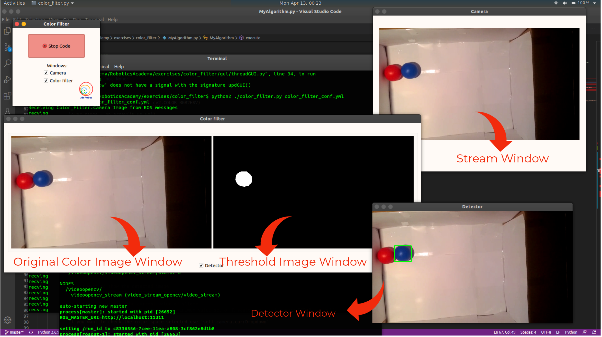

# Color Filter Exercise
		
In this practice the intention is to develop a color filter that allow us to segment some object in the image. You will have to get in contact with RGB and HSV color spaces, and *OpenCV* (*Python*) library.

For the exercise, we will need a node to publish the video stream. The *video_stream_opencv* package contains this node.
Add this packages if you don’t have it already:

`$ sudo apt install ros-melodic-video-stream-opencv`

<!--
For the realization of the practice, you are provided of a framework written in python that collects the images and allows its visualization. These images will be collected through several specific videos for this practice (pelota_roja.avi and pelotas_roja_azul.avi), although you could use your own videos instead or even a camera.

If you want to find the optimum values for your filter (in order to segment a concrete object) you can launch in a terminal the colorTuner component as follows (remember to run cameraserver tool as shown in line 39):

`$ colorTuner color_tuner_conf.yml`
-->

This practice allows to obtain the video stream from 3 different sources:
- From a local camera (Local)
- A local file (Video)
- Or through an ICE or ROS video driver (Stream)
Depending on the way you want to obtain the video, you must specify the selected video
source in the configuration file (color_filter_conf.yml), and the required paremeters for that source. 
Once done it, if you have selected either 'Local' or 'Video', follow the next step:

## How to execute?
### Set the video stream provider
Edit the video_stream_provider argument in the color_filter.launch file according to your choice of video stream.
You can use any input that OpenCV on your system accepts, e.g.:
- Video devices that appear in linux as /dev/videoX, e.g.: USB webcams appearing as /dev/video0
- Video streamings, e.g.: rtsp://wowzaec2demo.streamlock.net/vod/mp4:BigBuckBunny_115k.mov
- Video files, i.e., anything that you can play, e.g.: myvideo.avi

For camera we can continue with the value of this argument set to "0".

We also provide you with an example video that you can start the exercise with. This is the [Link](http://wiki.jderobot.org/store/amartinflorido/uploads/curso/pelotas_roja_azul.avi) to the video. Download it to your local system and accordingly update the value of video_stream_provider argument(in line 7 of color_filter.launch) in the launch file. For example, < *arg name="video_stream_provider" value="/home/<user>/Downloads/pelotas_roja_azul.avi"* />

Launch the ROS Server. Open the terminal with the directory set to *color_filter* in the exercises folder and run the command. 

` $ roslaunch color_filter.launch`

The above command opens the videostream and starts publishing it.
Next, ensuring you have written a workable code in MyAlogrithm.py file, run the following command in a new terminal.

`$ python2 ./color_filter.py color_filter_conf.yml`

<!--
If the selected video source is 'Stream', you must do the following:

First of all, ensure you have put the correct path in the configuraton file (cameraserver_conf.cfg) 
to the video over you want to apply the filter, and comment the line that access your local camera. This is:
```
[EXAMPLE]

CameraSrv.Camera.0.Uri = /home/username/Desktop/pelota_roja.avi
#CameraSrv.Camera.0.Uri=0
```

Once done it, in a terminal launch cameraserver component (ICE driver):
`$ cameraserver cameraserver_conf.cfg`

In other terminal launch the color_filter component:
`$ python2 ./color_filter.py color_filter_conf.yml`
-->

## How to do the practice?

To carry out the practice, you have to edit the file MyAlgorithms.py and insert in it your code, which enables the detection of a specific color and displays it in the GUI using the APIs given below.

## Where to insert the code?
[MyAlgorithm.py](MyAlgorithm.py)

```
    def execute(self):
       # Add your code here

        input_image = self.camera.getImage()
        if input_image is not None:
            self.camera.setColorImage(input_image)
	  
```
## GUI



## API
* `camera.getImage()` - to get the image received from server
* `camera.setColorImage(input_image)` - to set color image
* `camera.getColorImage()` - to get the color image
* `camera.setThresholdImage(bk_image)` - to set Threshold image
* `camera.getDetectImage()` - to get the Thresold image
* `setDetectImage()` - to set the final processed image to be displayed in the detector window 
* `getDetectImage()` - to get the detected image
