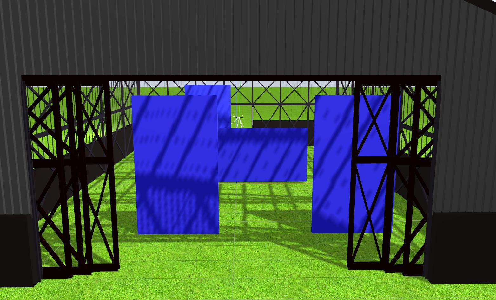

# Drone Hangar Exercise

## Goal

The goal of this exercise is to implement the logic that allows a quadrotor to escape a hangar filled with moving obstacles.



## Requirements

As this is a drones exercise, you will need to additionally install the `jderobot-assets`, `dronewrapper` and `rqt_drone_teleop` packages. These can be installed as

```bash
sudo apt-get install ros-kinetic-drone-wrapper ros-kinetic-rqt-drone-teleop ros-kinetic-drone-wrapper
```

There is an additional dependancy on MAVROS and PX4 that we are in the process of simplifying, however at the moment just use the script provided [here](https://github.com/JdeRobot/drones/blob/master/mavros_px4_sitl_installation.sh)

## Execution

To launch the exercise, simply use the following command from this directory:

`roslaunch drone_hangar.launch`

As an easy way to find the values for the color filtering, you can use the colorTuner tool provided in your jderobot installation. After launching the previous command, launch the `colorTuner` in a seperate terminal as follows:

`colorTuner colorTuner.conf`

## Solution

To solve the exercise, you must edit the my_solution.py file and insert the control logic into it. Your code is to be entered in the `execute` function between the `Insert your code here` comments.
[my_solution.py](my_solution.py#L46)

```python
def execute(event):
  global drone
  img_frontal = drone.get_frontal_image()
  img_ventral = drone.get_ventral_image()
  # Both the above images are cv2 images
  ################# Insert your code here #################################

  set_image_filtered(img_frontal)
  set_image_threshed(img_ventral)

  #########################################################################
```

## API

* `set_image_filtered(cv2_image)`: If you want to show a filtered image of the camera images in the GUI
* `set_image_threshed(cv2_image)`: If you want to show a thresholded image in the GUI
* `drone.get_frontal_image()` : Returns the latest image from the frontal camera as a cv2_image
* `drone.get_ventral_image()` : Returns the latest image from the ventral camera as a cv2_image
* `drone.get_position()`: Returns the position of the drone as a numpy array [x, y, z]
* `drone.get_orientation()`: Returns the roll, pitch and yaw of the drone as a numpy array [roll, pitch, yaw]
* `drone.get_roll()`: Returns the roll of the drone
* `drone.get_pitch()`: Returns the pitch of the drone
* `drone.get_yaw()`: Returns the yaw of the drone
* `drone.set_cmd_vel(vx, vy, vz, az)`: Commands the linear velocity of the drone in the x, y and z directions and the angular velocity in z in its body fixed frame

## Demonstrative video (in spanish)

https://youtu.be/Hd2nhOx1tqI?t=8m30s
