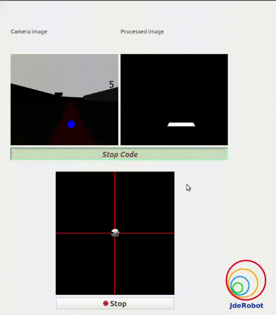
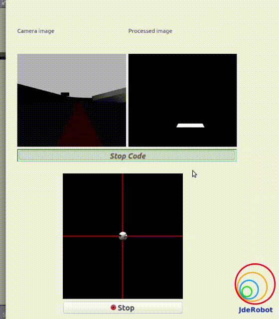

## Hints
Simple hints provided to help you solve the follow_line exercise. Please note that the full solution has not been provided.

### Detecting the Line to Follow
The first task of the assignment is to detect the line to be followed. This can be achieved easily by **filtering the color of the line** from the image and applying basic image processing to find the point or line to follow, or in Control terms our Set Point. Refer to these links for more information:

[Link1](https://www.pyimagesearch.com/2014/08/04/opencv-python-color-detection/)

[Link2](https://stackoverflow.com/questions/10469235/opencv-apply-mask-to-a-color-image)

[Link3](https://stackoverflow.com/questions/22470902/understanding-moments-function-in-opencv)

### Coding the Controller
The Controller can be designed in various configurations. 3 configurations have been descirbed in detail below:

#### P Controller
The simplest way to do the assignment is using the P Controller. Just find the error which is the difference between our *Set Point*(The point where our car should be heading) and the *Current Output*(Where the car is actually heading). Keep adjusting the value of the constant, till we get a value where there occurs no [**unstable oscillations**](#Illustrations) and no [**slow response**](#Illustrations).

#### PD Controller
This is an intersting way to see the effect of Derivative on the Control. For this, we need to calculate the derivative of the output we are receiving. Since, we are dealing with *discrete outputs in our case, we simply calculate the difference between our previous error and the present error*, then adjust the proportional constant. Adjust this value along with the P gain to get a good result.

#### PID Controller
This is the complete implemented controller. Now, to add the I Controller we need to integrate the output from the point where error was zero, to the present output. While dealing with discrete outputs, we can acheive this using *accumalated error*. Then, comes the task of adjustment of gain constants till we get our desired result.

#### Illustrations
 
*Unstable Oscillations*

*Slow Response*
