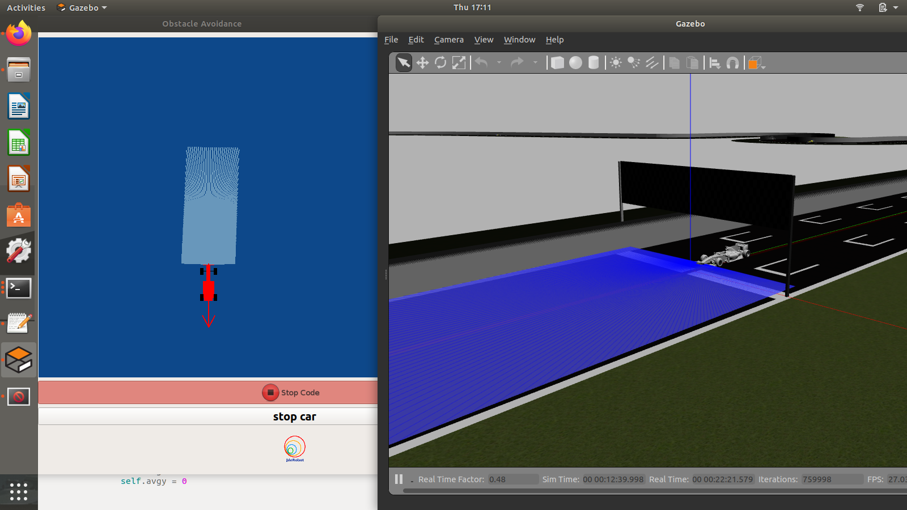
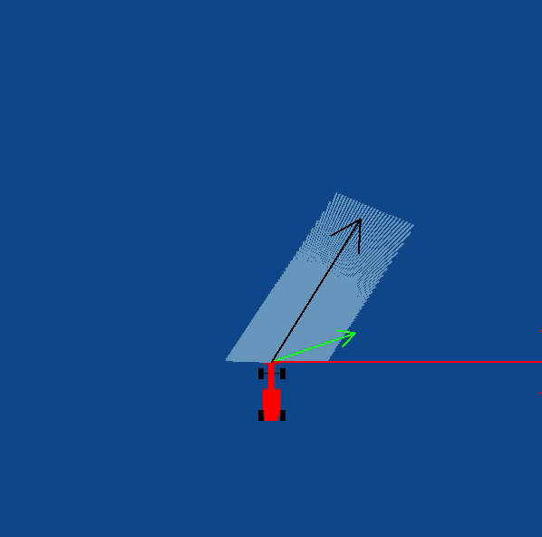
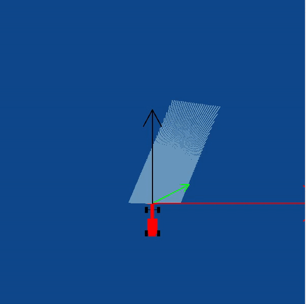

## Hints
Simple hints provided to help you solve the local_navigation exercise. Please note that the **full solution has not been provided.**

### Determining the Vectors
First of all, we need to generate the 3 required vectors, that are the **Target Vector**, **Obstacle Vector** and the **Direction Vector**.

#### Target Vector
The target vector can be easily obtained by subtracting the position of the car from the position of the next waypoint.

In order to implement this on the GUI interface of the exercise, in addition to the vector obtained by subtracting, we need to apply a rotation to the vector as well. The purpose of rotation is to keep the target vector always in the direction of the waypoint and not in front of the car. You may try seeing this in your own implementation, or refer to the the [illustrations](#Illustrations) 

Refer to this [webpage](https://en.wikipedia.org/wiki/Rotation_matrix#In_two_dimensions) to know about the exact mathematical details of the implementation.

#### Obstacle Vector
The obstacle vector is to be calculated from the sensor readings we obtain from the surroundings of the robot. Each obstacle in front of the car, is going to provide a repulsive vector, which we will add to obtain the resultant repulsive vector. Assign a repulsive vector, for each of the 180 sensor readings. The magnitude of the repulsive vector is inversly proportional to the magnitude of the sensor reading. Once, all the repulsive vectors are obtained they are all added, to get the resultant.

**Note**: There is a catch in this case, you may notice that most of the time in our implementation of the exercise we get an obstacle vector which is almost always pointing opposite to the direction in which we are supposed to head. This is a problem, as adding this vector directly to the target vector, would give a resultant which is more or less, quite not we expect. Hence, there is some trick we need to apply to solve this problem. Refer to the [theory page](./THEORY.md/#Drawbacks) to know more about the drawback of this algorithm.

*Obstacle Vector without any obstacles in front of the car*

#### Direction Vector
Conventionally and according to the research paper of the VFF algorithm, in order to obtain the direction vector we should add the target vector and the obstacle vector. But, due to an inherent problem behind the calculation of the obstacle vector, we cannot simply add them to obtain the resultant.

A simple observation reveals that we are required to **keep moving forward** for the purpose of this exercise. Hence, the component of the direction vector in the direction of motion of the car, has no effect on the motion of the car. Therefore, we can simply leave it as a **constant**, while adjusting the vector responsible for the steering of the car. It is the steering, that will in fact, provide us with the obstacle avoidance capabilities. Hence, the steering is going to be controlled by the Direction Vector.

Also, please note that this is **not the only solution** to this problem. We may also add an offset vector in the direction of motion of the car to cancel the effect of the redundant component.

### Illustrations

*On applying the rotation matrix*

*Without applying the rotation matrix*

*Oscillation Problem in Narrow Corridors*

### Problems with LIDAR
Due to the turns and bumps experienced by the car during course of its travel. The laser sensor present on the car may tilt from its original location, which may result in slow interpretation of the laser readings. Hence, affecting the performance of the code. A simple hack for this problem would be to visit `model.sdf` file of the formula1 car that is being used in the simulation and change the *joint type of sensor* from **revolute** to **fixed**. Although, this is an internal bug of the jderobot library, which will hopefully be resolved in the later versions of the source code.

#### References
Refer to the  for more details

The [research paper](http://www.cs.cmu.edu/~./motionplanning/papers/sbp_papers/integrated1/borenstein_cluttered_obstacle_avoid.pdf) of the VFF algorithm

[Vectors](https://www.mathsisfun.com/algebra/vectors.html)

[Rotation of Vectors](https://matthew-brett.github.io/teaching/rotation_2d.html)
