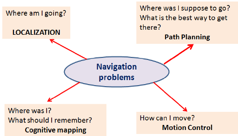
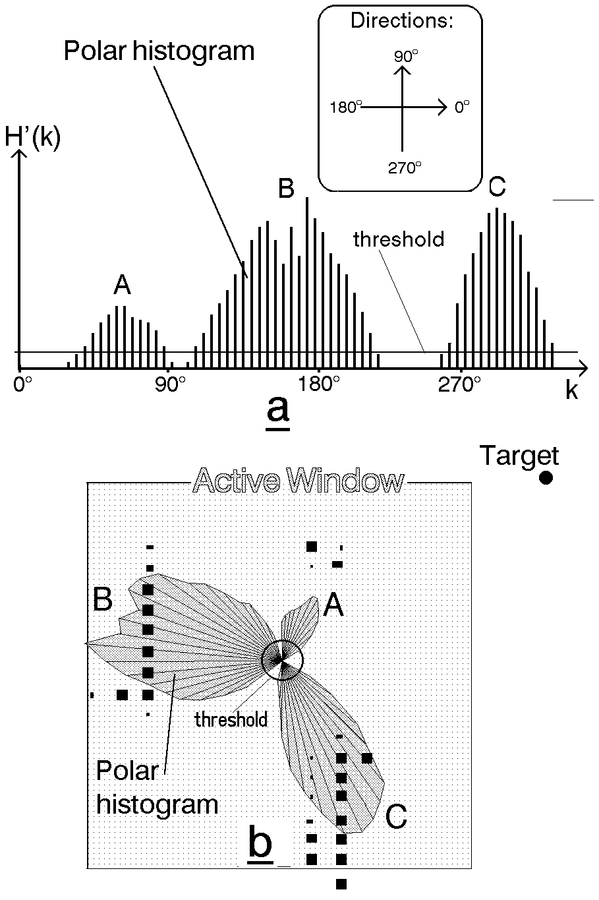

## Theory
This exercise requires us to implement a local navigation algorithm called Virtual Force Field Algorithm. Following is the complete theory regarding this algorithm.

### Navigation
Robot Navigation involves all the related tasks and algorithms required to take a robot from point A to point B **autonomously** without making any collisions. It is a very well studied topic in Mobile Robotics, comprising volumes of books! The problem of Navigation is broken down into the following subproblems:

	* **Localisation**: The robot needs to know where it is.
	* **Collision Avoidance**: The robot needs to detect and avoid obstacles
	* **Mapping**: The robot needs to remember its surroundings
	* **Planning**: The robot needs to be able to plan a route to the point B
	* **Explore**: The robot needs to be able to explore new terrain

Some of the ways to achieve the task of Navigation are as follows:

	* **Vision Based**: Computer Vision algorithms and optical sensors, like LIDAR sensors are used for Vision Based Navigation.
	* **Inertial Navigation**: Airborne robots use [inertial sensors](https://en.wikipedia.org/wiki/Inertial_measurement_unit) for Navigation
	* **Acoustic Navigation**: Underwater robots use SONAR based Navigation Systems
	* **Radio Navigation**: Navigation used RADAR technology.

The problem of Path Planning in Navigation is dealt in 2 ways, which are Global Navigation and Local Navigation

#### Global Navigation
Global Navigation involves the use of a map of the enviorment to plan a path from a point A to point B. The optimality of the path is decided based on the length of the path, the time taken to reach the target, using permanent roads etc. Global Positioning System(GPS) is one such example of Global Navigation. The algorithms used behind such systems may include [Dijkstra](https://www.youtube.com/watch?v=GazC3A4OQTE), Best First or [A*](https://www.youtube.com/watch?v=ySN5Wnu88nE) etc.

#### Local Navigation
Once the global path is decided, it is broken down into suitable waypoints. The robot navigates through these waypoints in order to reach it's destination. Local Navigation involves a dynamically changing path plan taking into consideration the changing surroundings and the vehicle constraints. Some examples of such algorithms would be Virtual Force Field, Follow Wall, Pledge Algorithm etc.

### Virtual Force Field Algorithm
The Virtual Force Field Algorithm works in the following steps:
	* The robot assigns an attractive vector to the waypoint that points towards the waypoint.
	* The robot assigns a repulsive vector to the obstacle according to its sensor readings that points away from the waypoint. This is done by summing all the vectors that are translated from the sensor readings.
	* The robot follows the vector obtained by summing the target and obstacle vector.

#### Drawbacks
There are a few problems related to this algorithm:
	* The robot tends to oscillate in narrow corridors, that is when the robot receives an obstacle vector simultaneously from opposite sides.
	* The robot may not be able to enter narrow corridors in the first place!

### Virtual Force Histogram Algorithm
This algorithm improves over the Virtual Force Field Algorithm, by using a data structure called the Polar Histogram. The robot maintains a histogram grid of the  instantaneous sensor values received. Then, based on the threshold value set by the programmer, the program detects minimas(vallies) in the polar histogram. The angle corresponding to these values are then followed by the robot.

**Note**: The exercise only requires us to implement Virtual Force Field Algorithm
	
### References
[1](http://www-personal.umich.edu/~johannb/vff&vfh.htm)
[2](https://en.wikibooks.org/wiki/Robotics/Navigation)
[3](https://en.wikipedia.org/wiki/Robot_navigation)
[4](https://www.hindawi.com/journals/jat/2018/6392697/)
[5](https://link.springer.com/chapter/10.1007/978-3-319-62533-1_7)
[6](https://www.researchgate.net/figure/The-virtual-force-field-VFF-concept-Occupied-cells-exert-repulsive-forces-onto-the_fig1_224749557)
 
