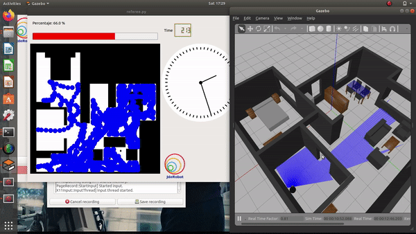
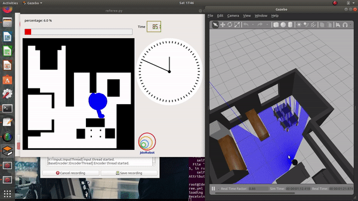
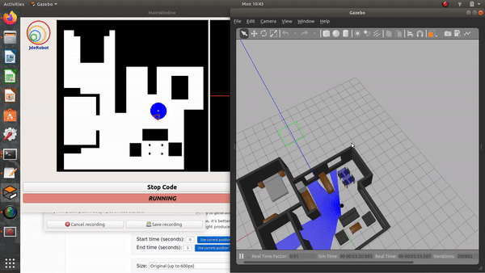
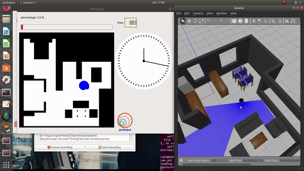

## Hints
Simple hints provided to help you solve the vacuum_cleaner exercise. Please note that the **full solution has not been provided.**

### Random Angle Generation
The most important task is the generation of a random angle. There are 2 ways to achieve it.

- **Random Duration**: By keeping the angular_velocity fixed, the duration of the turn can be randomized, in order to point the robot towards a random direction.

- **Random Angle**: This method requires calculation. We generate a random angle and then turn towards it. Approximately an angular speed of 3 turns the robot by 90 degrees.

Among both the methods, Random Duration would be a preferable one as the Random Angle requires precision, which requires PID to be achieved successfully.

Also, in order to acheive better precision it is preferable to use ```rospy.sleep()``` in place of ```time.sleep()```. 

### Dash Movement
Once the direction has been decided, we move in that direction. This is the simplest part, we have to send velocity command to the robot, until a collision is detected.

A word of caution though, whenever we have a change of state, we have to give a sleep duration to the robot to give it time to reset the commands given to it. [Illustrations](#Illustrations) section describes a visual representation.

### Spiral Movement
Using the physical formula **v = r . &omega;** (See [references](#References) for more details). In order to increase **r**, we can either increase **v** or decrease **&omega;**, while keeping the other parameter constant. Experimentally, increasing **v** has a better effect than decreasing **&omega;**. Refer to [illustrations](#Illustrations)

### Analysis
Being such a simple algorithm, it is not expected to work all the time. The maximum accuracy we got was 80% and that too only once!

### Illustrations
 

*Without applying a sleep duration the previous rotation command still has effect on the go straight command*



*After applying a duration, we get straight direction movement*



*Effect of reducing **&omega;** to generate spiral*



*Effect of increasing **v** to generate spiral*

#### References
Refer to the  for more details

Some reference on 
