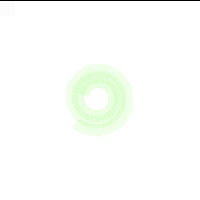

## Theory
Implementation of navigation algorithms for an autonomous vacuum is the basic requirement for this exercise. The main objective is to cover the largest area of a house. First, let us understand what is Coverage Algorithms.

### Coverage Algorithms
Coverage Path Planning is an important area of research in Path Planning for robotics, which involves finding a path that passes through every reachable position in its environment. In this exercise, We are using a very basic coverage algorithm called Random Exploration.

### Analyzing Coverage Algorithms
### Classification
Coverage algorithms are divided into two categories.
#### Offline coverage
use fixed information and the environment is known in advance. Genetic Algorithms, Neural Networks, Cellular Decomposition, Spanning Trees are some examples to name a few.

#### Online Coverage
uses real-time measurements and decisions to cover the entire area. The Sensor-based approach is included in this category.

### Base Movement
The problem of coverage involves two standard basic motions, which are used as a base for other complex coverage algorithms.
#### Spiral Motion
The robot follows an increasing circle/square pattern.

#### Boustrophedon Motion
The robot follows an S-shaped pattern.

### Analysis of Coverage Algorithms
Any coverage algorithm is analyzed using the given criterion.
#### Environment Decomposition
This involves dividing the area into smaller parts.

#### Sweep Direction
This influences the optimality of generated paths for each sub-region by adjusting the duration, speed, and direction of each sweep.

#### Optimal Backtracking
This involves the plan to move from one small subregion to another. The coverage is said to be complete when there is no point left to backtrack.

### Supplements
Usually, coverage algorithms generate a linear, piecewise path composed of straight lines and sharp turns. This path is difficult for other autonomous drones like Underwater Vehicles, Aerial Vehicles and some Ground Vehicles difficult to follow. Path Smoothening is applied to these paths to effectively implement the algorithm.

## References
For more information, have a look at the following links:

[Link1](https://en.wikipedia.org/wiki/Roomba)

[Link2](https://drive.google.com/file/d/1k_gYb5NS4J07-0gRnLNkQ3Tu63ElRjtq/view)

[Link3](https://drive.google.com/file/d/16fQNLeGdp2Dtx7xCcM-z2ImwjDJn2grF/view)

